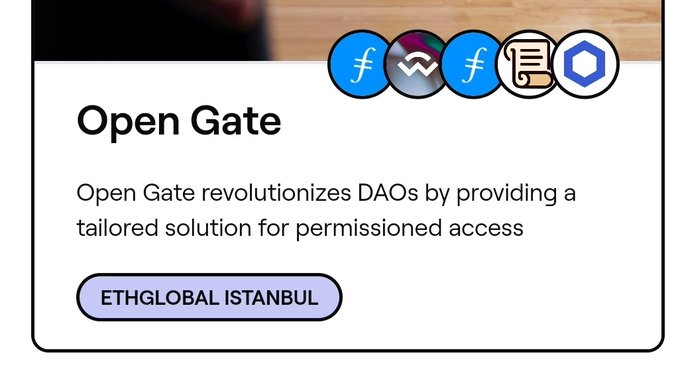
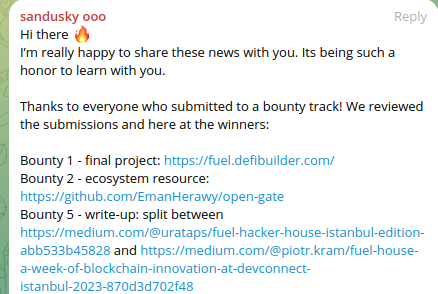

# Open Gate

## Introduction

Open Gate revolutionizes the landscape of Decentralized Autonomous Organizations (DAOs) by offering a tailored solution for permissioned access. Leveraging Proof of Contribution, it fosters a seamless, inclusive environment for token-gated communities. Our mission is to seamlessly bridge the divide between open-source contributions and equitable reward systems, catalyzing an engaged, diverse ecosystem.

## Awards & Recognitions
- Open gate is the winner of  5 bounties in ethglobal istanbul hackathon 2023. Check out the [Project Page](https://ethglobal.com/showcase/open-gate-23uyd) for more details.

-  Open gate is the winner of  ecosystem resource bounty in Fuel House hackathon 2023. 


## Challenges Addressed

1. **Accessibility in Token-Gated DAOs**:
   - **Issue**: Token-gated access in DAOs often excludes underrepresented communities and can be financially prohibitive for many developers.
   - **Impact**: This affects diversity and inclusivity, creating barriers to entry for a significant portion of potential contributors.

2. **Incentivization in Open-Source Communities**:
   - **Issue**: A prevalent lack of tangible rewards and recognition in open-source projects leads to diminished motivation for contributors.
   - **Impact**: This deficit in incentives results in slower project progression, reduced innovation, and challenges in maintaining a consistent contributor base.

3. **Community Engagement in DAOs**:
   - **Issue**: Many DAOs struggle to foster active, engaged communities, partly due to limited interaction channels and a lack of shared goals or rewards.
   - **Impact**: Weak community engagement can lead to a decline in collective decision-making, reduced innovation, and a lower sense of belonging among members.
## Ultimate Goal:
- **Open Gate** aims to bridge the gap between open-source contributions and equitable reward systems, catalyzing an engaged, diverse ecosystem. We envision a future where contributors are empowered to participate in DAOs and are rewarded for their efforts, leading to a more inclusive, collaborative, and innovative open-source community. This way, we hope to create a community that is more welcoming, works together, and comes up with new and exciting ideas. Our big dream is to offer different versions of this tool on various blockchains, helping DAO communities to build groups that last and include everyone.
## Overview

- **Target Users**: Enthusiastic Contributors and Open-source Project Owners.
- **Key Features**:
- Instant payment per contributions.
  - Trustless connections ensuring security and reliability.
  - Multi-chain support, enhancing versatility.
  - Diverse DAO journeys, catering to various user needs.
- **Technologies Used**: ink, AlphaZero network, openbrush.
- **Modular Integration**: Effortlessly integrate with any DAO structure.

## User Journey

### For Contributors

1. **Seamless Integration**: Login with GitHub, connect your crypto wallet, and establish a unique developer account on the blockchain using the GitHub username.
2. **Contribute and Engage**: Apply your skills to contribute to selected open-source projects, automatically linked to the user profile.
3. **Reward Mechanism**: After successful pull request acceptance:
   - Earn tokens for each contribution.
   - Promptly claim your rewards post-verification.

> The more contributions you make, the more tokens you receive, the greater your voting power, and the more benefits you enjoy.

### For Project Owners

1. **Effortless Setup**: Sign in using GitHub, link your crypto wallet, and create an organization account on the blockchain with your GitHub identity.
2. **Project Management and Bounty Allocation**: Add project repositories and define bounties for issue resolution, with a secure fund blocking mechanism for maintainers' rewards.

#### Benefits

1. **Enhanced Project Visibility and Attraction of Talent**: By listing projects on Open Gate, creators can gain increased visibility in the developer community. This can attract talented contributors who are incentivized to contribute due to the token-based reward system.

2. **Quality Contributions and Faster Development**: With the token-based reward system, contributors are motivated to provide high-quality work. This can lead to faster development cycles and more robust code contributions.

3. **Community Building and Governance**: Creators can build a dedicated community around their project. Contributors who earn tokens gain voting power, allowing them to participate in key project decisions, thereby creating a sense of ownership and community.

4. **Bounty-Based Issue Resolution**: Creators can set specific bounties for urgent or critical issues, ensuring these get prioritized and resolved quickly by capable contributors.

5. **Automated Reward Distribution**: The platform automates the process of rewarding contributors, reducing administrative overhead for project creators.

6. **Token Economy Integration**: Creators can integrate their project into a broader token economy, potentially increasing the utility and value of the tokens earned by contributors.

7. **Feedback Loop and Continuous Improvement**: With active contributor engagement, project owners receive continuous feedback, leading to iterative improvement and innovation in their projects.

8. **Diverse Contributor Pool**: Access to a global pool of contributors brings diverse perspectives and skill sets to the project, enhancing creativity and problem-solving.

9. **Sustainability and Long-term Growth**: The token-based incentive model can help sustain long-term project growth and development, as contributors are incentivized to stay engaged over time.

10. **Network Building**: Creators can build a network with other project owners and contributors, leading to potential collaborations and partnerships.

## Core Features

- **Modular Integration**: Effortlessly integrate with any DAO structure.
- **Instant Payments**: Reward contributors swiftly and securely.
- **Trustless Connections**: Establish secure, reliable blockchain interactions.
- **Multi-Chain Support**: Flexibility across different blockchain platforms.
- **Tailored DAO Journeys**: Customizable paths for different DAO models.

## Contract Architecture
   - **token_dao**: the contract act as a gate key to join any dao, usage inside any dao depends on the dao economy. This contract is developed  as an example , but feel free to use it in your own token. keep in mind that `contributor_pool` contract should be able to mint token for you custom designed token. 
   - **contributor_pool**: the contract is responsible for minting token for contributors. it is designed to be used in any dao. it is the core of the project. This contract should handle the relation between open source project creator and open source project contributors.
      - personas : The core functionality is to enable  Creators to list their github repos, set how the deposit that they will be paid , once the contributor create PR and close the issue , the contract release the payment to the contributor and mint DAO token to the contributors
   - **registration**: the contract is responsible for registering  developers/contributors and project creators. The contract requires that project creators hold a certain amount of DAO token to be able to create a project. Developers/contributors  are not required to hold DAO token to be able to contribute to a project. In fact, the main role of this tool is to give them free token based on their contribution.
   - **ownership**: the library is responsible for managing the ownership of the contracts. it is used to transfer the ownership of the contracts to the DAO token holders.
   - **token_gated_dao**: this contract is cloned from sawy example. Normal DAO contract that only allows token holders to vote. cloned for demonstration purposes.

## Getting Started

**Install Node Dependencies**
```bash
npm install
```

**Run the Project**
```bash
npm run dev
```
**build the contract**
```bash
cargo contract build --release
```


 
## Future Work

1. **Improved User Experience (UX) and User Journey**:
   - We are dedicated to refining the user interface and journey to make it more intuitive, engaging, and user-friendly. This involves redesigning navigation flows, simplifying processes, and introducing interactive elements to guide users smoothly through their tasks, whether they are contributing to a project or managing one.

2. **Meta-Transactions**:
   - To streamline interactions with the blockchain, we plan to implement meta-transactions. This will allow users to perform transactions on the blockchain without requiring them to hold native cryptocurrency for transaction fees, significantly lowering the entry barrier for new users.

3. **On-Chain Identity Tide with User Credentials**:
   - As part of our forward-looking development strategy, we plan to integrate a robust on-chain identity system tied with user credentials. This initiative aims to redefine how users interact and establish trust within the platform.

4. **Privacy and Security Innovations**:
   - **zkEmail and SBT Integration**: Implementing zkEmail for GitHub account proofs and minting SBTs for secure public key registration.
   - **Private Payment Options**: Introducing private payment systems to maintain the confidentiality of developer transactions.

5. **Automated Pull Request Tracking**:
   - Utilizing Chainlink's automation functions, we aim to automate the tracking and verification of pull requests, thereby enhancing the efficiency of contribution recognition and reward distribution.
5. **On-chain check**:
   - Utilizing Chainlink's functions, we aim to  check and verify the pull requests, thereby enhancing the efficiency of contribution recognition and reward distribution.
   - OR ZK Email integration or any similar projects in Alpha-Zero  ecosystem.


6. **Collaborative Community Hub**:
   - **Integrated Networking and Job Opportunities**: A networking section will be added for collaboration and job opportunities, connecting developers with projects and roles that match their skills.
   - **Community Forums**: These will serve as platforms for knowledge exchange, discussions, and community support, enriching the collaborative spirit of the ecosystem.


## Deployed contracts 
> Contract dao_token Deployed!

    Network:  
    Contract ID: 0x60245c4b9dce24af257b7e83844fb037f83def447fe77d6e16cec06948e0ab0c
    Deployed in block 0x33a82764a84f75f6c1c25cfb76c6a7da61d900b7f7e3d92fe4dd6b3b60939e37


> Contract registration Deployed!

    Network: 
    Contract ID:  
    Deployed in block  

> Contract contribution_pool Deployed!

    Network: 
    Contract ID:  
    Deployed in block  
## License

MIT

 